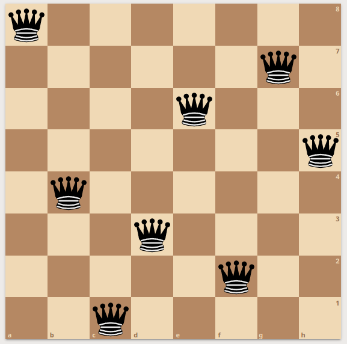
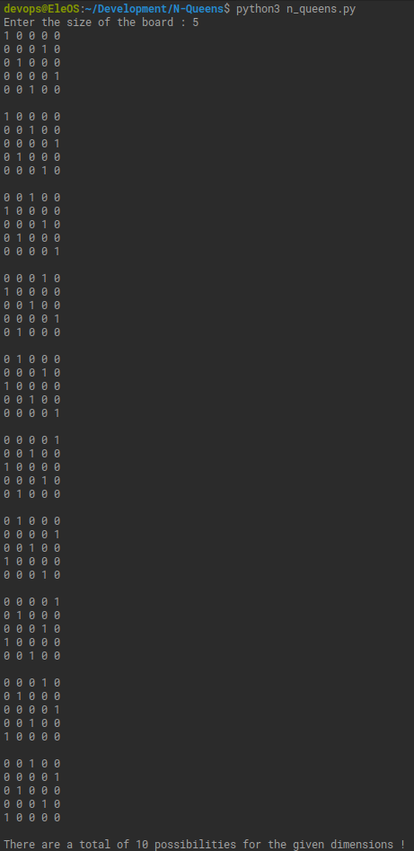

# N-Queens

<h2>Introduction</h2>
<p>N queens is a famous puzzle of placing N queens in a NxN gridboard. The puzzle originates from the Eight queens puzzle in chess.</p>
<p>To better understand the problem, first we need to understand a queen's moves in chess.</p>
<p align="center">
  
  </p>
<p>In some ways, the queen can be thought of as the most powerful piece on the chessboard. The above image shows the moves avilable to the queen in the next move. It can move along the four main directions as well as diagonally; not limited by the number of jumps. Therefore, the challenge is to place 8 queens in a 8x8 chessboard such that no queen can attack another.</p>

<p>This program finds out all the possible solutions for a given dimension of the board.</p>


<p>One such solution is given below : </p>
<p align="center">
  
  </p> 
<p> This is just one possible solution to the above problem. There are 12 unique solutions to 8x8 puzzle. These solutions can be rotated to obtain even more solutions. In total, this would amount to 92 solutions for a chessboard.</p>

<h2>Technology</h2>
<ul type="disc">
  <li>Python 3.6.9</li>
  </ul>

<h2>Cloning</h2>
<p>Open Terminal in your preferred directory and type :</p>

```
git clone https://github.com/InvincibleJuggernaut/N-Queens.git
```

<h2>Usage</h2>
<p>Open the repository and open Terminal to run the program using :</p>

```
python3 n_queens.py
````
<p align="center">
  
  </p>


